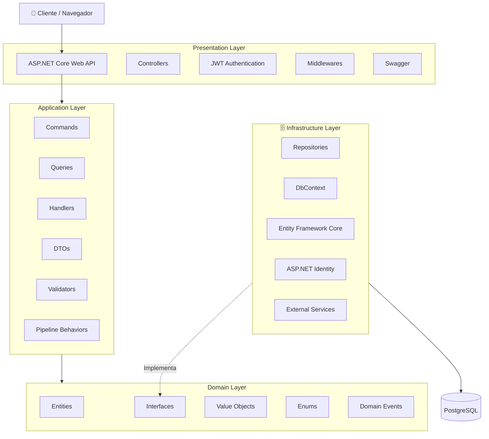

# Índice

1. Introducción
2. Stack tecnológico
3. Arquitectura del software
4. Estructura del proyecto
5. Diseño de la base de datos
6. Diseño de interfaces

---

# 1. Introducción

El presente documento describe el diseño técnico del sistema **AsistenciaPyme**.

Se presentan las tecnologías, la arquitectura, la estructura del proyecto, la base de datos y las interfaces principales que se utilizarán para desarrollar la aplicación.

---

# 2. Stack tecnológico

| Área                 | Tecnología            | Uso                              |
| -------------------- | --------------------- | -------------------------------- |
| Lenguaje             | C#                    | Desarrollo del backend           |
| Backend              | ASP.NET Core Web API  | Creación de la API REST          |
| ORM                  | Entity Framework Core | Acceso a los datos               |
| Proveedor            | Npgsql                | Conexión entre .NET y PostgreSQL |
| Base de datos        | PostgreSQL            | Almacenamiento de información    |
| Autenticación        | JWT                   | Gestión de usuarios y acceso     |
| Frontend             | Pendiente de definir  | Desarrollo de la interfaz web    |
| Documentación API    | Swagger               | Documentación y prueba de la API |
| Control de versiones | Git y GitHub          | Gestión del código fuente        |
| Documentación        | Obsidian y Markdown   | Documentación del proyecto       |
| Diagramación         | Excalidraw y Mermaid  | Creación de diagramas            |

---

# 3. Arquitectura del software

El backend utilizará **Clean Architecture** para separar las responsabilidades del sistema.

También aplicará el patrón **CQRS**, separando las operaciones que modifican información de las operaciones de consulta.

## 3.1 Capas de la solución

- **Domain:** entidades, interfaces y reglas del negocio.
- **Application:** Commands, Queries, Handlers, DTOs y validaciones.
- **Infrastructure:** Entity Framework Core, repositorios, Identity y PostgreSQL.
- **WebApi:** Controllers, Middlewares, JWT, Swagger y configuración de la API.

## 3.2 Diagrama de arquitectura



---

# 4. Estructura del proyecto

El código fuente estará organizado dentro de la carpeta `src`.

```text
AsistenciaPyme/
├── docs/
│   ├── documento-requisitos.md
│   ├── documento-diseno.md
│   
│
└── src/
    ├── AsistenciaPyme.Domain/
    ├── AsistenciaPyme.Application/
    ├── AsistenciaPyme.Infrastructure/
    └── AsistenciaPyme.WebApi/
```

| Proyecto | Responsabilidad |
|---|---|
| Domain | Entidades y reglas del negocio |
| Application | Casos de uso y CQRS |
| Infrastructure | Persistencia y servicios técnicos |
| WebApi | Endpoints y configuración de la API |

La capa `Application` organizará los casos de uso por módulos:

```text
Features/
├── Auth/
├── Empleados/
├── Asistencia/
├── Vacaciones/
├── Planillas/
└── Reportes/
```

Cada módulo podrá contener:

```text
Empleados/
├── Commands/
├── Queries/
├── DTOs/
└── Validators/
```

---

# 5. Diseño de la base de datos

La información será almacenada en una base de datos relacional **PostgreSQL**.

## 5.1 Entidades principales

| Entidad | Descripción |
|---|---|
| Usuario | Datos de acceso, rol y estado |
| Empleado | Información personal y laboral |
| Cargo | Cargo, funciones y responsabilidades |
| Asistencia | Registros de entrada y salida |
| Vacación | Solicitudes y estado de vacaciones |
| Planilla | Información salarial por periodo |
| Deducción | Descuentos aplicados a la planilla |

## 5.2 Relaciones principales

- Un usuario podrá estar asociado con un empleado.
- Un cargo podrá estar asignado a varios empleados.
- Un empleado podrá tener varias asistencias.
- Un empleado podrá solicitar varias vacaciones.
- Un empleado podrá tener varias planillas.
- Una planilla podrá contener varias deducciones.

## 5.3 Diagrama entidad-relación

> El diagrama entidad-relación se elaborará después de definir los atributos y relaciones definitivas de las tablas.

---

# 6. Diseño de interfaces

El sistema mostrará diferentes pantallas según el rol del usuario.

## 6.1 Pantallas generales

- Inicio de sesión.
- Dashboard.
- Perfil.
- Cambio de contraseña.

## 6.2 Pantallas del administrador

- Gestión de empleados.
- Consulta y corrección de asistencias.
- Gestión de vacaciones.
- Gestión de planillas y deducciones.
- Visualización de reportes.

## 6.3 Pantallas del empleado

- Registro de entrada y salida.
- Historial de asistencia.
- Solicitud de vacaciones.
- Consulta de planillas y deducciones.
- Perfil.
