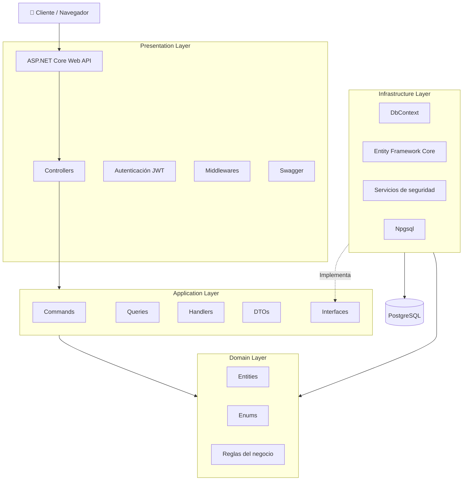
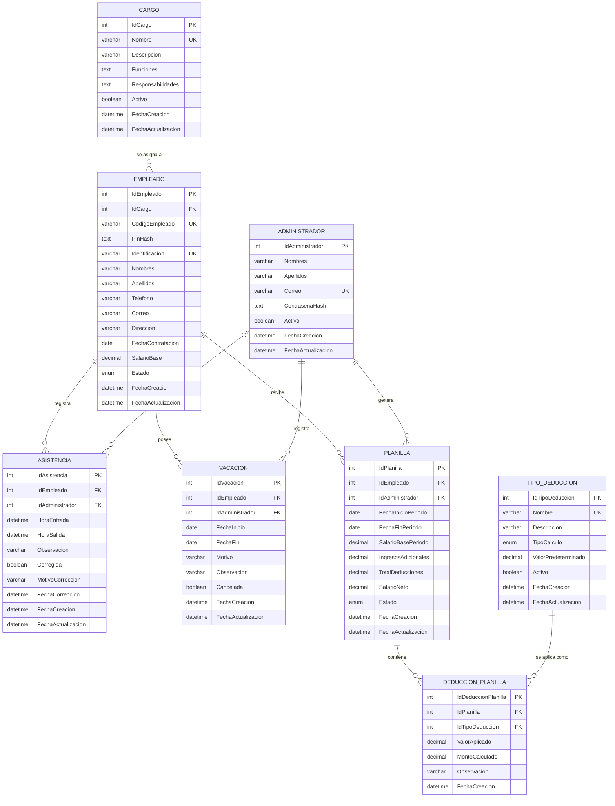

# Índice

1. Introducción
2. Stack tecnológico
3. Arquitectura del software
4. Estructura del proyecto
5. Diseño de la base de datos
6. Diseño de interfaces

---

# 1. Introducción

El presente documento describe el diseño técnico del sistema **AsistenciaPyme**.

Se presentan las tecnologías, la arquitectura, la estructura del proyecto, el diseño de la base de datos y las interfaces principales del sistema.

---

# 2. Stack tecnológico

| Área                 | Tecnología                                   | Uso                            |
| -------------------- | -------------------------------------------- | ------------------------------ |
| Lenguaje             | C#                                           | Desarrollo del backend         |
| Backend              | ASP.NET Core Web API                         | API REST                       |
| ORM                  | Entity Framework Core                        | Acceso a datos                 |
| Base de datos        | PostgreSQL                                   | Almacenamiento de información  |
| Proveedor            | Npgsql                                       | Conexión con PostgreSQL        |
| Autenticación        | Autenticación personalizada con PBKDF2 + JWT | Acceso al panel administrativo |
| Frontend             | HTML5, CSS3 y JavaScript                     | Interfaz web                   |
| Documentación API    | Swagger                                      | Pruebas de la API              |
| Control de versiones | Git y GitHub                                 | Gestión del código             |
| Documentación        | Markdown y Obsidian                          | Documentación del proyecto     |
| Diagramación         | Excalidraw y Mermaid                         | Diagramas                      |

---

# 3. Arquitectura del software

El backend utiliza **Clean Architecture** para separar las responsabilidades del sistema.

También aplica el patrón **CQRS**, separando las operaciones que modifican información de las operaciones de consulta.

## 3.1 Capas de la solución

- **Domain:** Entidades, enumeraciones y reglas del negocio.
- **Application:** Commands, Queries, Handlers, DTOs e interfaces.
- **Infrastructure:** Entity Framework Core, PostgreSQL, persistencia y servicios de seguridad.
- **WebApi:** Controllers, autenticación JWT, middlewares y configuración de la API.

## 3.2 Diagrama de arquitectura



---

# 4. Estructura del proyecto

El proyecto está organizado como un monorepositorio con las carpetas `backend`, `frontend` y `docs`.

AsistenciaPyme/
├── backend/
│   ├── AsistenciaPyme.slnx
│   └── src/
│       ├── AsistenciaPyme.Domain/
│       ├── AsistenciaPyme.Application/
│       ├── AsistenciaPyme.Infrastructure/
│       └── AsistenciaPyme.WebApi/
│
├── frontend/
│   ├── index.html
│   ├── shared/
│   │   ├── css/
│   │   └── js/
│   └── modules/
│       ├── kiosco/
│       ├── login/
│       ├── dashboard/
│       ├── cargos/
│       ├── empleados/
│       ├── asistencias/
│       ├── administradores/
│       └── deducciones/
│	     └── vacaciones/
│	     └── planillas/
│
└── docs/
    ├── documento-requisitos.md
    └── documento-diseno.md

| Proyecto | Responsabilidad |
|----------|-----------------|
| Domain | Entidades y reglas del negocio |
| Application | Casos de uso y CQRS |
| Infrastructure | Persistencia y servicios de seguridad |
| WebApi | API REST y configuración |

La capa **Application** organiza los casos de uso por módulos.

```text
Features/
├── Administradores/
├── Autenticacion/
├── Cargos/
├── Empleados/
├── Asistencias/
├── Vacaciones/
├── TiposDeduccion/
└── Planillas/
```

Cada módulo puede contener:

```text
Empleados/
├── Commands/
├── Queries/
└── DTOs/
```

---

# 5. Diseño de la base de datos

La información será almacenada en una base de datos relacional PostgreSQL.

## 5.1 Entidades principales

| Entidad           | Descripción                                   |
| ----------------- | --------------------------------------------- |
| Administrador     | Usuario con acceso al panel administrativo.   |
| Empleado          | Información personal, laboral, código y PIN.  |
| Cargo             | Cargo, funciones y responsabilidades.         |
| Asistencia        | Registros de entrada y salida.                |
| Vacación          | Vacaciones registradas para el empleado.      |
| Planilla          | Información salarial por período.             |
| TipoDeduccion     | Catálogo de tipos de deducciones disponibles. |
| DeduccionPlanilla | Deducciones aplicadas a una planilla.         |

## 5.2 Relaciones principales

- Un cargo puede estar asignado a varios empleados.
- Un empleado puede registrar múltiples asistencias.
- Un empleado puede tener varios registros de vacaciones.
- Un empleado puede tener varias planillas.
- Una planilla puede contener varias deducciones.
- Un tipo de deducción puede aplicarse en diferentes planillas.

## 5.3 Diagrama entidad-relación

# Diagrama entidad-relación — AsistenciaPyme



---

# 6. Diseño de interfaces

El sistema contará con dos interfaces principales.

## 6.1 Módulo de marcaje

Pantalla utilizada por los empleados desde un dispositivo fijo ubicado en la empresa.

Permitirá:

- Ingresar código de empleado.
- Ingresar PIN.
- Registrar asistencia.
- Mostrar la confirmación del marcaje.

El sistema determinará automáticamente si corresponde registrar una entrada o una salida.

### Flujo de funcionamiento

1. El empleado ingresa su código.
2. El empleado ingresa su PIN.
3. El sistema valida las credenciales.
4. Si no existe una asistencia abierta, registra la hora de entrada.
5. Si existe una asistencia abierta, registra la hora de salida.
6. El sistema muestra una confirmación del registro.

---

## 6.2 Panel administrativo

Disponible únicamente para el administrador autenticado.

Contará con las siguientes pantallas:

- Inicio de sesión.
- Dashboard.
- Gestión de cargos.
- Gestión de empleados.
- Gestión de asistencias.
- Gestión de vacaciones.
- Gestión de tipos de deducción.
- Gestión de planillas.

### Funcionalidades principales

Desde el panel administrativo será posible:

- Administrar cargos.
- Administrar empleados.
- Consultar asistencias registradas.
- Registrar asistencias manualmente cuando sea necesario.
- Administrar vacaciones.
- Administrar tipos de deducción.
- Generar y consultar planillas.
- Cambiar la contraseña del administrador.
- Cambiar el PIN de los empleados.